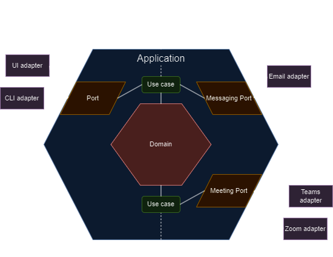

Table of Contents
- [Project Architecture](#project-architecture)
- [Application Cycle](#application-cycle)
- [More Detailed Explanations](#more-detailed-explanations)
  - [PDF Scraper](#pdf-scraper)
  - [Meeting Scheduler](#meeting-scheduler)
## Project Architecture
This project is my take on a hexagonal architecture

- Ports are used as interfaces that allow communication with the application
- Adapters are the bridge between ports and the outside world. There can be multiple adapters for a single port
- Use cases (or services), contain application specific rules and interact with the domain layer
- The domain layer contains domain/enterprise logic and models (example: 'what is a course and its rules')

## Application Cycle
The application go along with the following cycle

1. An UI/CLI will be shown at the start of the application (so that the user can input, review and update meeting information)
2. Service selection. Login + authorize Zoom / MS Teams
3. Data input - PDF scraper / manual input
4. Review / update data and email template
5. Create meeting
6. Send emails if needed

## More Detailed Explanations

### PDF Scraper
The pdf scraper uses PyMuPDF's  (fitz) library to scrape data from a pdf template.\
[TEMPLATE](./pdf_template.pdf) used for this project.

Due to the way this PDF is created, the best way I found to get the data is to create "bounding boxes" and read all words directly inside each box.

To create the bounding boxes, there's a script I used during the testing phase available [HERE](./supporting_files/extract_pdf.py)

### Meeting Scheduler
For both schedulers, the cycle is nearly the same
- The user authorizes our application to create meetings via Oauth2.0 device flow grant
  - The device flow was needed because this project runs as a desktop application, not web based
  - After requesting and receiving the device code response, a browser window is opened so the user can grant authorization. During this, the application keeps requesting access to the service until the authorization is granted or a timeout is reached
- After authorization, data can be inputted manually or using the pdf scraper
- The application calls the respective service (Teams/Zoom) and creates a meeting
- The application sends emails to all participants (can be disabled)

Each scheduler has an adapter, that communicates with its respective service